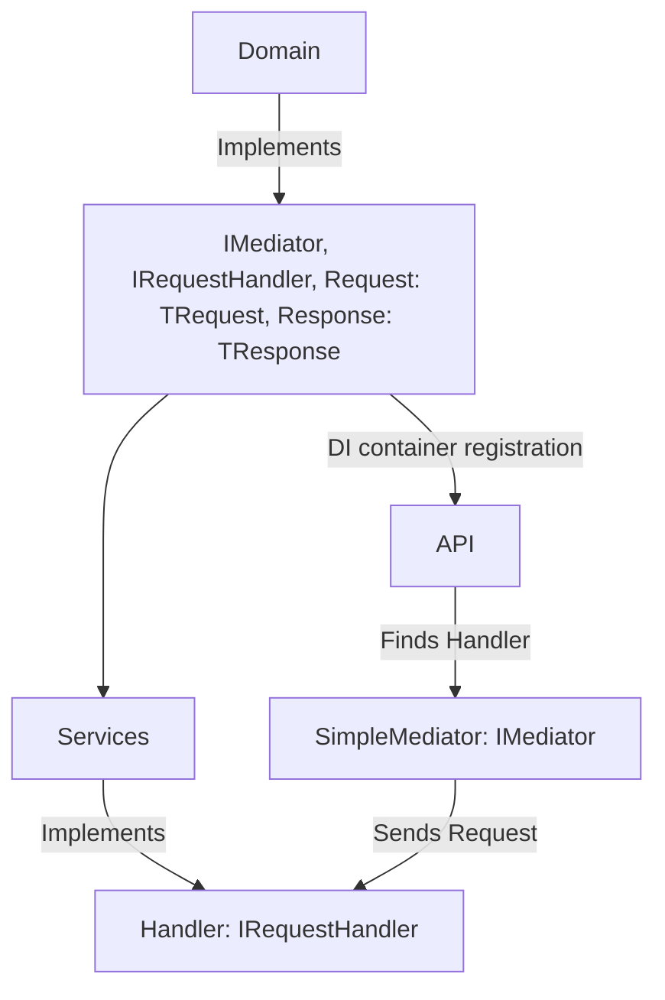

# MinMediator
Minimal custom mediator example  



## serilog  

https://github.com/serilog/serilog-aspnetcore

## ArchUnit.Net  
[manual](https://archunitnet.readthedocs.io/en/latest/)  

``` ps1
dotnet add package TngTech.ArchUnitNET
dotnet add package TngTech.ArchUnitNET.xUnit
```  

IObjectProvider<IType> declares collection of all types. It is more generic
as it retrieves all types (classes, interfaces, enums..) .
IObjectProvider<Class> declares collection of all classes, is more specific as it retrieves only classes.  


