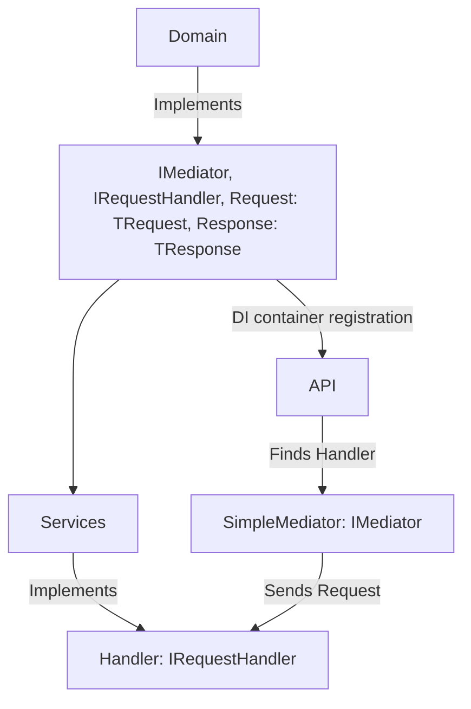

# MinMediator
Minimal custom mediator example  

```mermaid
flowchart TD
	A[Domain] -->|Implements| B[IMediator, IRequestHandler<TRequest, TResponse>, Request: TRequest, Response: TResponse ]
	B --> S
	S[Services] --> |Implements| H[Handler: IRequestHandler<Request, Response>]
	B -->|DI container registration| C[API]
	C -->|Finds Handler| D[SimpleMediator: IMediator]  
	D --> |Sends Request| H
```

